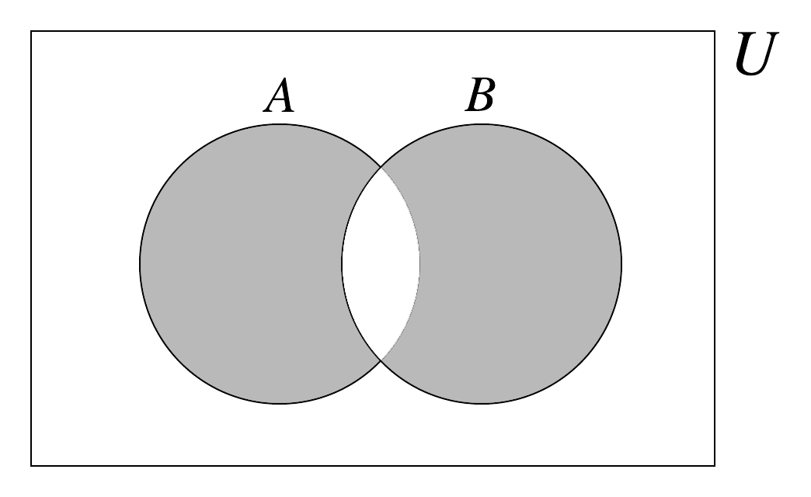

The symmetric difference between two sets $$A$$ and $$B$$, denoted $$A \bigtriangleup B,$$ is the collection of elements $$x$$ of $$A$$ or $$y$$ of $$B$$ so that $$x$$ is not in $$B$$ nor $$y$$ is not in $$A$$. 
$$A \bigtriangleup B = \{x \text{ so that } x \in (A \cup B) - (A \cap B)\}$$ 

**Example 1:**
 Let $$A$$ = {1, 2, 3, 4, 5} and $$B$$ = {5, 6, 7, 8, 9}.  Then we notice that the union of the sets $$A$$ and $$B$$ would be the collection of positive integers from 1 to 9.  There is one element that is in common to both the sets, the element 5.  Thus, $$A \bigtriangleup B = \{1, 2, 3, 4, 6, 7, 8, 9\}.$$
The symmetric difference of sets $$A$$ and $$B$$ is illustrated graphically using the Venn Diagram below:
 
<!---  --->

Another way of phrasing the symmetric difference of sets $$A$$ and $$B$$ is to say $$A \bigtriangleup B$$ is the union of elements that are unique to each of $$A$$ and $$B.$$  The shaded area in the Venn diagram below represents the symmetric difference of $$A$$ and $$B$$:


<!---  --->

Using our set notation:

$$A \bigtriangleup B = \{x \vert (x \in A$$ and $$x \notin B)$$ or $$(x \notin A$$ and $$x \in B)\}$$

Equivalently:

$$A \bigtriangleup B = (A-B) \cup (B-A)$$

$$A \bigtriangleup B = (A \cup B) - (A \cap B)$$, where $$\bigtriangleup$$ 

A different way to view symmetric difference $$\bigtriangleup$$ is in terms of the *exclusive OR* operation, which is denoted as $$XOR$$ or $$\oplus$$.
 
$$A \bigtriangleup B = \{ x \vert (x \in A) \oplus (x \in B) \}$$

$$XOR,$$ $$\oplus,$$ is a logical binary operation which output values {True, False}. It is the case that $$x \oplus y$$ is true only when the input terms $$x$$ and $$y$$ differ as shown in the truth table below:

| $$x$$ | $$y$$ | $$x \oplus y$$|
| :----: | :----: | :----:|
| `F (False)` | `F (False)` | `F (False)`|
| `F (False)` | `T (True)` | `T (True)`|
| `T (True)` | `F (False)` | `T (True)`|
| `T (True)` | `T (True)` | |

 

|||[Discrete Structures](../../../../)||| [Prev](../set-intersection)||| [Next](../cartesian-product)