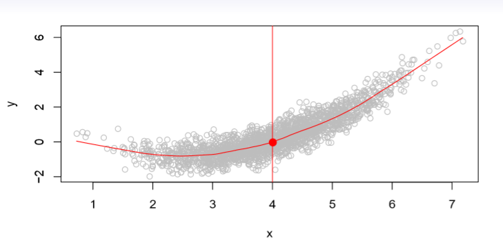

### What is Statistical Learning?

- Shown are Sales vs TV, Radio and Newspaper, with a blue linear-regression line fit separatly to each.
- Can we Predict Sales using these three?
- Perhaps we can do better using a model

Sales = f(TV, Radio, Newspaper)

### Notation

- Here Sales is a response or target that we wish to predict. We generically refer to the response as Y . 
- TV is a feature, or input, or predictor; we name it X1. 
- Likewise name Radio as X2, and so on. 
- We can refer to the input vector collectively as

$$X =\left(\begin{array}{c}X_1\\ X_2\\X_3\end{array}\right)$$

- Now we write our model as

$$Y= f(X) +\epsilon$$

- where $$\epsilon$$ captures measurement errors and other discrepancies.

### What is f(X) good for?

- With a good $$f$$ we can make predictions of $$Y$$ at new points $$X = x$$. 
- We can understand which components of $$X = (X_1, X_2,...,X_p)$$ are important in explaining $$$$Y$$ , and which are irrelevant. e.g. Seniority and Years of Education have a big impact on Income, but Marital Status typically does not.
- Depending on the complexity of $$f$$, we may be able to understand how each component $$X_j$$ of $$X$$ affects $$Y$$.

Is there an ideal $$f(X)$$? In particular, what is a good value for $$f(X)$$ at any selected value of $$X$$, say $$X = 4$$? There can be many $$Y$$ values at $$X = 4$$. A good value is

$$f(4) = E(Y|X = 4)$$

E(Y|X = 4) means expected value average of Y given X = 4.

This ideal f(x) = E(Y|X = x) is called the regression function

|||[Index](../../)||| [Prev](../)||| [Next](part2)|||
