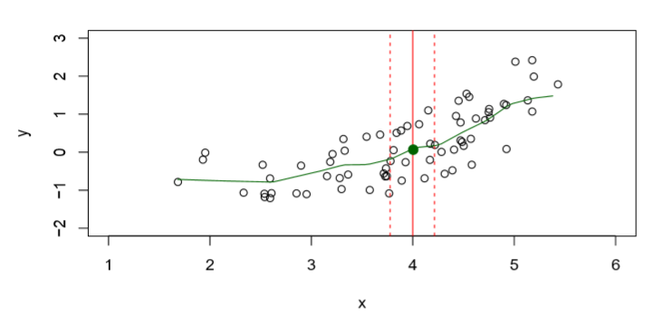

### The regression function f(x)

- Is also defined for vector $$X$$ ; e.g. 

$$f(x) = f(x_1,x_2,x_3)=E(Y|X_1=x_1, X_2 = x_2, X_3 = x_3)$$

- Is the ideal or optimal predictor of $$Y$$ with regard to mean-squared prediction error: 
$$f(x) = E(Y|X = x)$$ is the function that minimizes $$E\{Y-g(X))^2|X=x\}$$ over all functions $$g$$ at all points $$X = x$$.
- $$\epsilon=Y-f(x)$$ is the irreducible error — i.e. even if we knew $$f(x)$$, we would still make errors in prediction, since at each $$X = x$$ there is typically a distribution of possible $$$Y$$ values.
- For any estimate $$\hat{f}(x)$$ of $$f(x)$$, we have our errors:
 $$E[(Y-\hat{f}(X))^2|X=x]=[f(x)-\hat{f}(x)]^2+Var(\epsilon)$$

### How to estimate f 

Typically we have few if any data points with $$X = 4$$ exactly.
So we cannot compute $$E(Y|X = x)!$$ 
Relax the definition and let $$\hat{f}(x)=Ave(Y|X\epsilon N(x))$$ where $$N(x)$$ is some neighborhood of $$x$$.

- Nearest neighbor averaging can be pretty good for small $$p$$ (number of features X) — i.e. $$p ≤ 4$$. 
- We will discuss some techniques, such as kernel and spline smoothing later in the course.
- Nearest neighbor methods can be not effective when p is large. Reason: the curse of dimensionality. Nearest neighbors tend to be far away in high dimensions.
-- We need to get a reasonable fraction of the $$N$$ values of $$y_i$$ to average to bring the variance down—e.g. 10%.
-- A 10% neighborhood in high dimensions need no longer be local, so we lose the spirit of estimating $$E(Y|X = x)$$ by local averaging.

### Curse of Dimensionality

### Sample Code: curse of dimension
- Higher dimensions -> more troubles
- <https://github.com/ruiwu1990/CSCI_4120/tree/master/curse_of_demensionality>

|||[Index](../../)||| [Prev](../)||| [Next](../part2)
