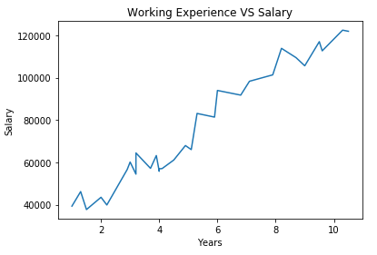

### A Very Helpful Book
- Available online: <https://jakevdp.github.io/PythonDataScienceHandbook/>
- Many useful sample. We will use some in this class.

### Matplotlib
- Matplotlib: the most popular python plot library in my opinion
- Data visualization library built on NumPy arrays and designed to work with the broader SciPy.
- version 0.1 was released in 2003.
- Sample Code: Introduction-To-Matplotlib.ipynb at <https://github.com/ruiwu1990/CSCI_4120/blob/master/Matplotlib/04.00-Introduction-To-Matplotlib.ipynb>.

### Matplotlib Sample Code
1. Python import libraries with a short name:
* Import matplotlib as mpl
2. Magic function: show(), display visualization results not in Jupyter notebook, you can also do it in a terminal or iPython.
3. show() should be used only once per Python session. For example, if you execute “python plot.py” in a terminal, you should only have show() executed in the plot.py file once.
4. “%matplotlib inline” will lead to static images of your plot embedded in the notebook
5. plot(x,y,’-’) function, solid line
6. subplot(x,y,z): rows, columns, panel number

### How to Draw Simple Line Plots
1. Let’s learn basics about simple line plots
2. Sample Code: Simple-Line-Plots.ipynb <https://github.com/ruiwu1990/CSCI_4120/blob/master/Matplotlib/04.01-Simple-Line-Plots.ipynb>
3. seaborn-whitegrid: grid graph
4. Basic steps:
* Initialization: create a figure and axes.
* Define x-axis data and y-axis data
* Set labels
* Plot(): if you do not define still, color parameters, matplotlib will use default values
5. About colors: names, short color code (e.g. r,g,b) <https://matplotlib.org/2.0.2/api/colors_api.html>, gray scale, hex code, RGB values, HTML names (<https://www.w3schools.com/colors/colors_names.asp>)
6. Line style:
* String: solid, dashed…
* Code: ‘-’, ‘\-\-’ …
* Combined style with color: -g (solid green), \-\-r (dashed red)
* Set the range: xlim(-1, 11) from -1 to 11, you can even reverse the range

### Group Activity Plot 1
- Finish the TODO section
- Your graph should be similar to this:

- Github Source Code: <https://github.com/ruiwu1990/CSCI_4120/blob/master/Matplotlib/Group%20Activity%20Plot%201.ipynb>
- Colab Source Code: <https://colab.research.google.com/github/ruiwu1990/CSCI_4120/blob/master/Matplotlib/Group%20Activity%20Plot%201.ipynb>

||[Index](../../../)||| [Prev](../k-part2/)|||[Next](../k-part4/)|||
