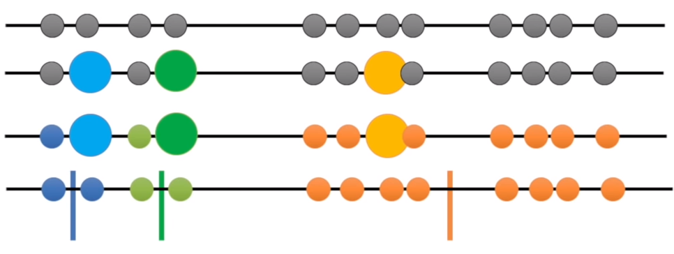
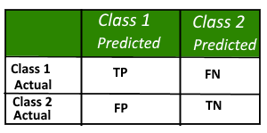
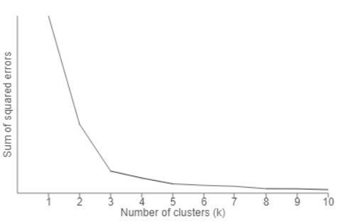
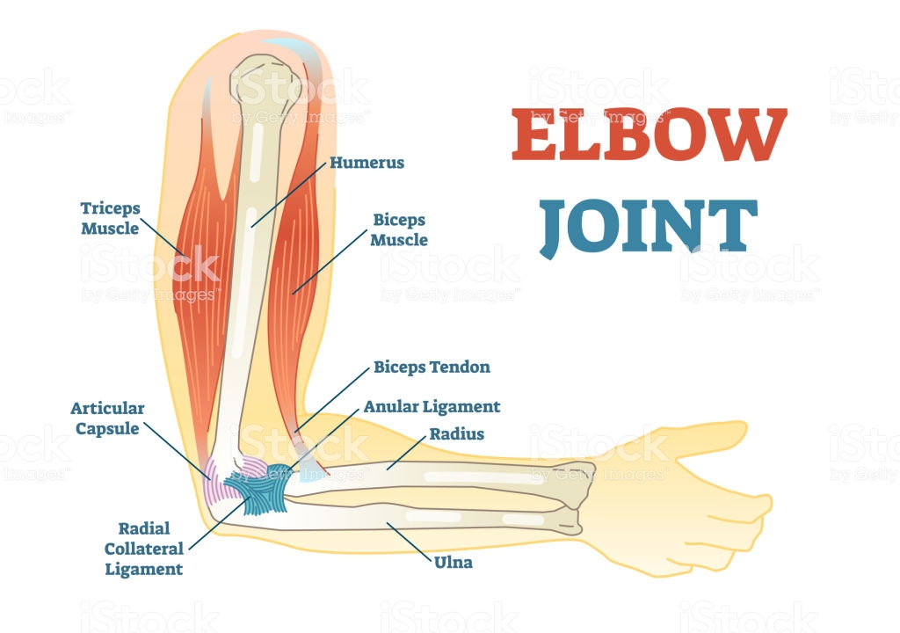

- Kmeans clustering aims to partition n observations into k clusters in which each observation belongs to the cluster with the <mark>nearest mean</mark>.
- If you want to separate different car models into 4 categories based on horsepower, engine displacement, and MPG, you can use K-means.
- <mark>Question: is Kmeans supervised or unsupervised learning?</mark>
- K represents # of centroids.

Figure Credit: <https://blogs.oracle.com/bigdata/k-means-clustering-machine-learning>

### K-Means: How does it work?
- Here are K-means algorithm steps:
	* Step 1: Choose a K: it represents the number of centroids. Hard to decide… especially for high dimensional data. You will learn how to do this in your homework 2.
	* Step 2: Randomly selected centroids positions
	* Step 3: Calculate distances between each data point with K centroids and decide cluster response (closer)
	* Step 4: Calculate the mean value of each cluster, use the mean value as the new centroid
	* Step 5: repeat step 3 and 4 until you have repeated N (maybe 100) times or centroids do not change anymore.
- Kmeans is unsupervised learning and a clustering algorithm (involves the grouping of data points). 

- The following figure shows how we decide which group a data point belongs to.

- The image below is a good cluster result using Kmeans.

Figure Credit: <https://blogs.oracle.com/bigdata/k-means-clustering-machine-learning>

### An Example
- Let's tale a closer look at the following 2D example and review the steps.

- Things can go wrong like the image below:

- <mark>Question: how to avoid this?</mark>
- Same steps for higher dimensional data.

Example is based on: https://www.youtube.com/watch?v=4b5d3muPQmA

### Group Activity
- Group Activity 3: <https://github.com/ruiwu1990/CSCI_4120/blob/master/K-Means/Group%20Activity%203.ipynb>
- Finish to do section, you will have the K-means implementation from scratch.
- Seaborn is a Python data visualization library based on matplotlib. It provides a high-level interface for drawing attractive and informative statistical graphics.
- pairwise_distances_argmin: Compute minimum distances between one point and a set of points, similar to finding neighbors function from KNN
- Kmeans(k, random_state): k how many neighbours, random_state determines random number generatation for centroid initialization
- How to cluster non-linear data? Map your data into a higher dimension and apply k-means. In sklearn: SpectralClustering.

### K-Means: Advantages vs Disadvantages
#### Advantages:
- Easy to implement.
- K-means model dynamically updated: centroid can be updated if new dataset is added.

#### Disadvantages:
- Hard to guess K
- Initial centroid can impact results
- K-means is time consuming. Need to calculate distances between new centroid in every loop.
- K-means method may not find out the global best solution. It sometimes returns local optimum.
- K-means is limited to linear cluster boundaries.

### Classification Definition of Terms
- Based on: <https://www.geeksforgeeks.org/confusion-matrix-machine-learning/>
- <mark>Question: how to judge if a classification results are good or not.</mark>
- Need to learn the following concepts and then we can answer the question:
	- Positive (P) : Observation is positive (for example: is an apple).
	- Negative (N) : Observation is not positive (for example: is not an apple).
	- True Positive (TP) : Observation is positive, and is predicted to be positive.
	- False Negative (FN) : Observation is positive, but is predicted negative.
	- True Negative (TN) : Observation is negative, and is predicted to be negative.
	- False Positive (FP) : Observation is negative, but is predicted positive.

### Confusion Matrix
- Used for classification results.
- A confusion matrix is a summary of prediction results on a classification problem.
- The number of correct and incorrect predictions are summarized with count values and broken down by each class. This is the key to the confusion matrix.
- The confusion matrix shows the ways in which your classification model is confused when it makes predictions.
- It gives us insight not only into the errors being made by a classifier but more importantly the types (to be learned) of errors that are being made.
- An example of 2-class classification problem (image below)
	- Class 1 : Positive
	- Class 2 : Negative
	- 
- Figure credit: <https://www.geeksforgeeks.org/confusion-matrix-machine-learning>

### K-Means: Advanced Examples
- Sample Code: <https://github.com/ruiwu1990/CSCI_4120/blob/master/K-Means/05.11-K-Means.ipynb>
- Example 1 Handwriting digit recognition:
	- 8*8 data matrix to represent a digit handwriting image
	- Each image is a data point and the centroid of each cluster is also an image
	- Matplotlib imshow: render a 2D regular image
	- np.zero_like(clusters): create a matrix with all zeros, the shape is the same as the “clusters” matrix.
	- TSNE: a method to reduce dimension, it models each high-dimensional object by a two- or three-dimensional point in such a way that similar objects are modeled by nearby points and dissimilar objects are modeled by distant points with high probability.
- Example 2 Color Compression
	- numpy.random.permutation: Randomly permute a sequence, or return a permuted range; same numbers but different orders
	- Matrix.T: .T is to transpose a numpy matrix
	- MiniBatchKMeans: calculate distances between the centroid and only a random sample of observations as opposed to all observations. Faster but may perform not as good as traditional K-Means.

### K-Means: how to find a good K
- How to judge if a K-means algorithm is good?
	- First you need a measure: one of the most popular one is named “distortion” or “SSE” based on sum of squared errors (SSE), (datapoint - centroid)^2.
	- Compare distortion with K. The best K is at the rapid change point, creating elbow shape.
	- This method is usually called “elbow” method because the shape is like an elbow.
	- <mark>Question: why larger K, less distortion?</mark>
	- 
	- Figure credit: <https://bl.ocks.org/rpgove/0060ff3b656618e9136b>
	- 
	- Figure credit: <https://www.dreamstime.com/elbow-joint-vector-illustrated-diagram-medical-scheme-educational-sports-injury-information-elbow-joint-vector-illustrated-diagram-image108866773>

### Group Homework 2: Find an Appropriate K for K-means
- Goal: learn how to find a good K using Elbow Method library
- You need to use the command "python3 hw2.py" to check the outputs
- Complete todo section in HW2: <https://github.com/ruiwu1990/CSCI_4120/tree/master/HW_elbow_kmeans>
- Use KElbowVisualizer to decide K for K-means
	- Install: 
	- pip3 install yellowbrick
	- Read document about the function: <https://www.scikit-yb.org/en/latest/api/cluster/elbow.html>
- Draw a Confusion Matrix
- README.MD file
	- Team member names and email addresses
	- Quick Start
	- K*K matrix, K is decided in by KElbowVisualizer
	- Which K works the best
	- The best K accuracy
	- Insert a confusion matrix for the best K
- <mark>Due September 28</mark>.

||[Index](../../../)||| [Prev](../k-part3/)|||
