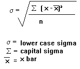

- Correlation can be used to represent relationships between variables.
  * Positive Correlation: both variables change in the same direction.
  * Neutral Correlation: No relationship in the change of the variables.
  * Negative Correlation: variables change in opposite directions.
- <mark>Pearson’s Correlation vs Spearman’s Correlation</mark>
  * The Pearson correlation coefficient (named for Karl Pearson) can be used to summarize the strength of the <mark>linear relationship</mark> between two data samples.
  * Spearman’s correlation coefficient (named for Charles Spearman) can be used to summarize the strength between the two data samples, if two variables may be related by a <mark>nonlinear relationship</mark> or two variables being considered may have a <mark>non-Gaussian distribution</mark>.

### Covariance vs Correlation
- Covariance is nothing but a measure of correlation. On the contrary, correlation refers to the scaled form of covariance.
- The value of correlation takes place between <mark>-1 and +1</mark>. Conversely, the value of covariance lies between <mark>-∞ and +∞</mark>. 
- Covariance is affected by the change in <mark>scale</mark>, i.e. if all the value of one variable is multiplied by a constant and all the value of another variable are multiplied, by a similar or different constant, then the covariance is changed. As against this, correlation is not influenced by the change in scale.
- Correlation is <mark>dimensionless</mark>, i.e. it is a unit-free measure of the relationship between variables. Unlike covariance, where the value is obtained by the product of the units of the two variables.

$$cov_{xy} =  \sigma _{xy} = E[(X- \mu_X) (Y- \mu _Y)]$$

$$corr_{xy} =   \rho  _{xy} = E[(X- \mu_X) (Y- \mu _Y)]/( \sigma _X \sigma _Y)$$

$$\mu_{X}$$ represents the mean value.

### Homework 3: Group Homework
- group Homework
- Complete "regression to the Mean" Exercise 1 and 2
- README.MD
  * Team member names and email addresses
  * 2 result graphs from exercise 1 and 2
- Due <mark>Oct. 9</mark>

### Correlation Sample Code
- Sample Code:<https://github.com/ruiwu1990/CSCI_4120/blob/master/Linear_regression/Correlation_sample_code.ipynb>
- Correlation_sample_code
- Plt.title: use pad to define padding away from your figure
- Df.corr can calculate correlation matrix between all columns
- Matshow can show correlation value comparison within a matrix.

||| [Index](../../)||| [Prev](../)||| [Next](../mlr/)|||
