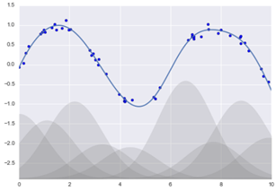
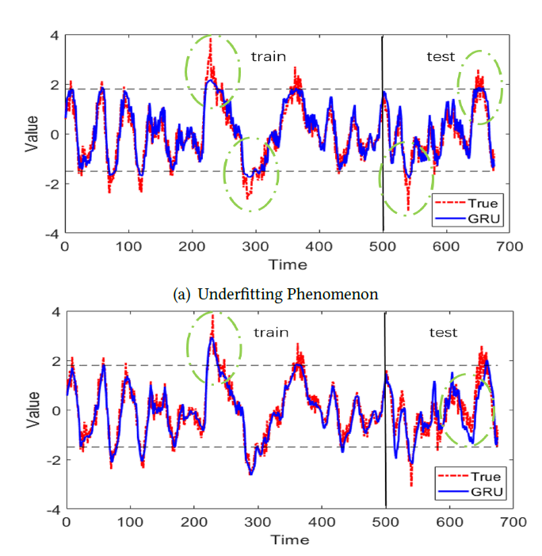

## What about non-linear relationships?
- Trick: transform data according to basis functions
- Polynomial basis function: 
- Gaussian basis function: a sum of Gaussian bases. Does not directly supported by sklearn but we will write one by ourselves.

$$y = a_0 + a_1x_1 +a_2x_2+a_3x_3+...$$

## Linear Regression Sample Code
- Linear-Regression
- x[:, np.newaxis] => make it as column vector by inserting an axis along second dimension
- np.linspace(0, 10, 1000): generate 1000 numbers between 0 and 10
- numpy.random.rand(n,m): randomly generate numbers between [0,1) to fill n*m matrix
- How you define a function’s coefficient: y = 0.5 + np.dot(X, [1.5, -2., 1.]) => [1.5, -2., 1.] is the coefficient for x1, x2, and x3.
- fit_transform: Generate polynomial and interaction features: [a, b], the degree-2 polynomial features are [$$1, a, b, a^2, ab, b^2$$].
- N degree polynomial means the highest degree of term x.
- make_pipeline: Construct a Pipeline from the given estimators. In the example, we define the basis function and regression method.

## Overfitting vs Underfitting
- Overfitting is the production of an analysis that corresponds too closely or exactly to a particular set of data (training) and may therefore fail to fit additional data or predict future observations (testing) reliably. (wiki)
- Underfitting occurs when a statistical model cannot adequately capture the underlying structure of the data. An underfitted model is a model where some parameters or terms that would appear in a correctly specified model are missing. (wiki)

Source: Ding, D., Zhang, M., Pan, X., Yang, M. and He, X., 2019. Modeling Extreme Events in Time Series Prediction. KDD (knowledge discovery and data mining) 2019.

## Overfitting
- Overfitting issue: a model works very well for training data

$$\Theta _0+ \Theta _1x + \Theta _2x^2$$

$$\Theta _0+ \Theta _1x + \Theta _2x^2+ \Theta _3x^3+ \Theta _4x^4$$

Figure credit: https://www.youtube.com/watch?v=KvtGD37Rm5I

- Objective function: In order to find the optimal solution, we need some way of measuring the quality of any solution.
- Possible solutions: besides minimize RSS score, we should also penalize ϴ3 and ϴ4.
  * Objective function = min(RSS + 1000* ϴ3 + 1000* ϴ4)
  * Therefore, if ϴ3 or ϴ4 is too big, it will be penalized=> ϴ3 ≈ 0, ϴ4 ≈ 0

||| [Index](../../)||| [Prev](../mlr/)||| [Next](../regularization/)|||
