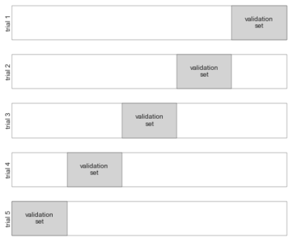

- Holdout sets for validation: hold back some subset of the training data and this part is called holdout set. Then we use this part data for test.
  * What are the possible disadvantages?
- Cross-validation: sometimes called rotation estimation or out-of-sample testing, is any of various similar model validation techniques for assessing how the results of a statistical analysis will generalize to an independent data set. 

- K-fold cross validation: k is the number of number of sections/folds. 
- K-fold cross validation is very useful for model performance estimation and model parameter tuning (HW4).

## Sample Code
- Model Validation
- Accuracy_score: calculate classification accuracy rate, works for multiple classes
- Cross_val_score: automatically split data following cross validation ideas.

Source Code: <https://github.com/ruiwu1990/CSCI_4120/blob/master/Evaluation/Model%20Validation.ipynb>

## Group Activity 6
- Leave One Out: it is still cross validation. Each time, only one element is left for test, i.e. validation set size is always one.
- Leave-one-out cross-validation is approximately unbiased, because the difference in size between the training set used in each fold and the entire dataset is only a single pattern. 
- It tends to have a high variance (so you would get very different estimates if you repeated the estimate with different initial samples of data from the same distribution).

- Source Code: <https://github.com/ruiwu1990/CSCI_4120/blob/master/Evaluation/Model%20Validation.ipynb>

- Based on: <https://stats.stackexchange.com/questions/154830/10-fold-cross-validation-vs-leave-one-out-cross-validation>

## Parameter Tuning
- Grid Search:
  * Grid search is an approach to parameter tuning that will methodically build and evaluate a model for each combination of algorithm parameters specified in a grid.
  * The grid search provided by sklearn.model_selection.GridSearchCV exhaustively generates candidates from a grid of parameter values specified with the param_grid parameter. For instance, the following param_grid:
  

- Random Search:
  * Random search is an approach to parameter tuning that will sample algorithm parameters from a random distribution (i.e. uniform) for a fixed number of iterations. A model is constructed and evaluated for each combination of parameters chosen.
- Examples and more details can be found here: 
<https://scikit-learn.org/stable/modules/grid_search.html#exhaustive-grid-search>

## Homework 4: Group Homework
- Parameter Tuning and Select Best Model
- In Regularization jupyter notebook, we have walked through a bicycle traffic prediction example. You are required to compare “LinearRegression”, “Lasso”, and “Ridge” regression models. Select the best one based on 10-fold cross validation results. Please use the same features (holiday, daylight_hrs …) to predict traffic as shown in the sample code.
- You need to tune alpha for “Lasso” and “Ridge.” To do it, you should use “RandomizedSearchCV” (<https://scikit-learn.org/stable/modules/generated/sklearn.model_selection.RandomizedSearchCV.html>)
- README.MD file
  * Team member names and email addresses
  * All three models’ cross validation scores and alpha value (if applied)
  * Which model performs the best
  
||| [Index](../../)||| [Prev](../metrics-for-evaluation-2/)|||
