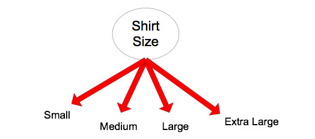
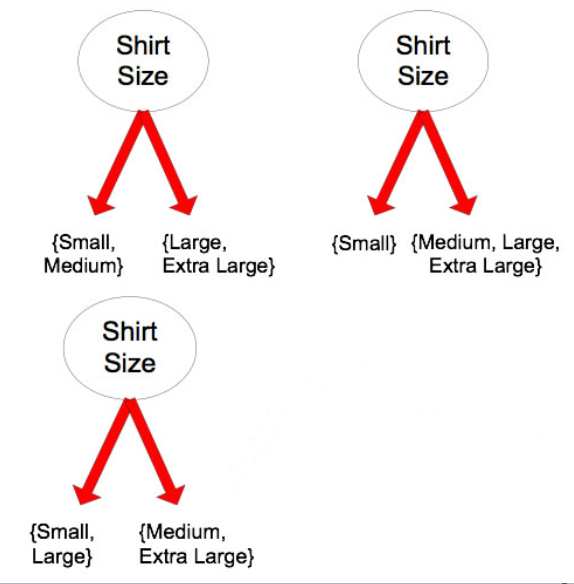
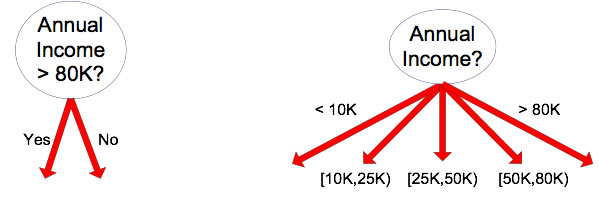

## Split Attributes

* Attributes can be:
  * Nominal: order does not matter, such as female and male
  * Ordinal: order matters, such as freshman, sophomore, junior, senior
  * Continuous: numbers, continuous values, such as salary 80K
* Methods to split:
  * Multi-way: use as many partitions as values in nominal/binary cases
  * Binary: yes or no, such as home owner or not, female or not, salary more than 80k or not.

## Split Attributes: Challenges

* What kind of attribute? Which method?
  * 
  * 
  * 
  * 
  * 

  

## How to determine the best split?
* Which one is the best split based on your opinion?

### Answers to the challenges
  * Nominal, Multi-way
  * Ordinal, Multi-way
  * Nominal, Binary
  * Ordinal, Binary
  * Continuous, Binary
  * Continuous, Multi-way

||[Index](../../../)||| [Prev](../)|||[Next](../tree3)|||
