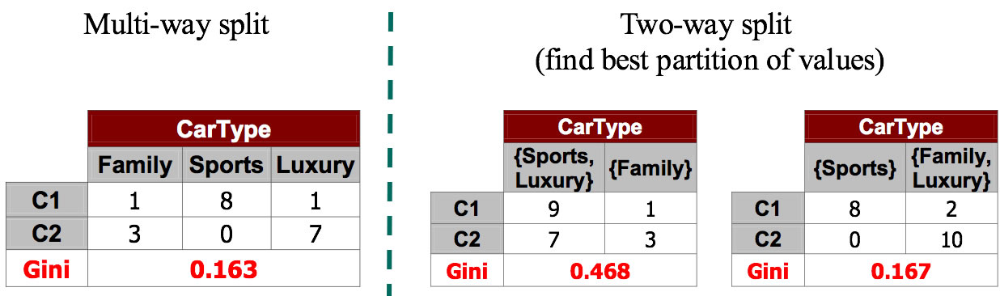
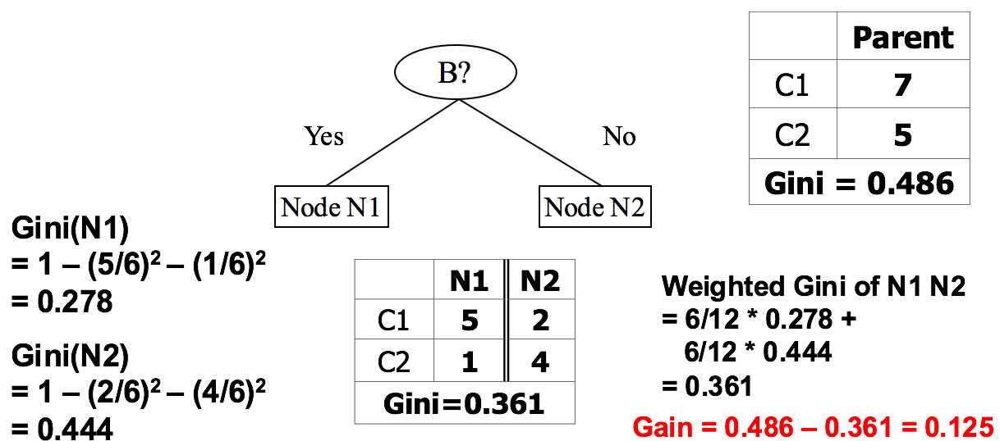

## Measures of performance
* Measures of performance? Three usually used methods
  * Gini Index: Based on impurity
  * Entropy: similar to the Gini Index, is known as the Cross-Entropy or Deviance
  * Classification Error Rate: Based on error
* Let’s have a closer look at this Gini Index first

$$GINI(t)=1- \sum_{j}[p(j | t)]^2$$

* Here t is the node index; j is the class index; p(j/t) represents the proportion of training observations.
* Gini index is a measure of total variance across the K classes (impurity).
* Lower Gini(t) means better.

### Group work Calculate Gini Index:

<!--  -->

<!--  -->

<!--  -->



## Measures of performance—Gini

$$GINI(t)=1- \sum_{j}[p(j | t)]^2$$

* With a split of [0,6]: P(C1) = 0/6 = 0   P(C2) = 6/6 = 1, then $$Gini([0,6]) = 1 – P(C1)^2 – P(C2)^2 = 1 – 0 – 1 = 0.000$$
* Caculate the rest...

## Categorical and Continuous Attributes
* Same idea can be applied with categorical attributes. Which is better?
* 
* How to choose thresholds for continuous attributes? We can also use Gini index.
* 
* How to decide the threshold for continuous attributes?
* 

## Mesure of Overall Perfomance
* Compute impurity measure (P) before splitting
* Compute impurity measure (M) after splitting
  * Compute impurity measure of each child node
  * M is the weighted impurity of children
* Choose the attribute test condition that produces the highest gain: 
* Information Gain = P - M

$$GINI_{split} = \sum_{i=1}^k\frac{n_i}{n}GINI(i)$$

* where ni = number of records at child i and n = number of records at parent node p.
* 

## Measures of performance—Entropy
* I know it is still a little bit confusing. Let’s learn what is Entropy and then we will build a tree together.
* Entropy:

$$Entropy(t) = - \sum_{j}p(j | t)log [p(j | t)]$$
 
* is the entropy for a given node t of class j. That is, p(j / t) is the relative frequency of class j at node t.

* <mark>Maximum</mark> is $$log Nc$$ when records are equally distributed among all classes implying least information. Nc is the number of classes. E.g., if you have three classes and 6 records (i.e. the node is like this C0:2, C1:2, C2:2=> -(1/3)log(1/3)-(1/3)log(1/3)-(1/3)log(1/3)), has  maximum is –log(1/3) = 0.477.
* <mark>Minimum</mark> is 0.0 when all records belong to one class, implying most information, e.g., C0:5, C1:0=> -1*log1 – (-infi)*0= 0
* <mark>Lower</mark> Entropy, means <mark>better</mark>

### Group work:

* Log0 = -inif
* With a split of [0,6]: P(C1) = 0/6 = 0   P(C2) = 6/6 = 1, then Entropy([0,6]) = – 0 log 0 – 1 log 1 = – 0 – 0 = 0.000 
* Please calculate the rest...

## Measures of performance—Gain

$$GAIN_{split}=Entropy(p)-( \Sigma _{i=1}^{k} \frac{n_i}{n}Entropy(i))$$

* Parent Node, p is split into k partitions where ni is number of records in partition i
* Choose the split that achieves most reduction, which maximizes GAIN
* Entropy is used in the ID3 and C4.5 decision tree algorithms.

### Group Activity Answers
* GINI:
	* With a split of [1,5]: P(C1) = 1/6 and P(C2) = 5/6, then Gini([1,5]) = 1 – (1/6)2 – (5/6)2 = 0.278
	* With a split of [2,4]: P(C1) = 1/3 and P(C2) = 2/3, then Gini([2,4]) = 1 – (1/3)2 – (2/3)2 = 0.444
	* With a split of [3,3: P(C1) = 1/2 and P(C2) = 1/2, then Gini([3,3]) = 1 – (1/2)2 – (1/2)2 = 0.500
* Entropy:
	* With a split of [1,5]: P(C1) = 1/6 and P(C2) = 5/6, then Entropy([1,5]) = – (1/6) log2 (1/6) – (5/6) log2 (1/6) = 0.65
	* With a split of [2,4]: P(C1) = 2/6 and P(C2) = 4/6, then Entropy([2,4]) = – (2/6) log2 (2/6) – (4/6) log2 (4/6) = 0.92
	* With a split of [3,3: P(C1) = 1/2 and P(C2) = 1/2, then Entropy([3,3]) = – (1/2) log2 (1/2) – (1/2) log2 (1/2) = 1.00

||[Index](../../../)||| [Prev](../)|||[Next](../tree4)|||
