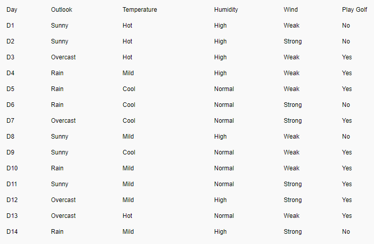
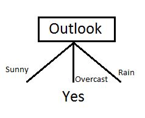
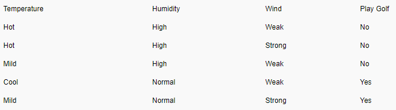
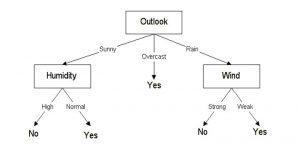

## Decision Tree—An Example

* Example is from: <https://www.xoriant.com/blog/product-engineering/decision-trees-machine-learning-algorithm.html>

* Compare performance of different columns
* Performance is calculated using Entropy (impurity) and Information Gain (IG) (i.e. parents - children)
* Higher IG means better
* P(x) is the probability (proportion) of event x
* H(S) entropy for what we want to classify (i.e. parent)

$$H(S) =  \sum_{x \epsilon X}p(x)log_2 \frac{1}{p(x)}$$

$$IG(S,A)=H(S) -  \sum_{i=0}^np(x)*H(x)$$

$$Entropy(S) =  \sum{x \epsilon X}p(x)log_2 \frac{1}{p(x)}$$ 

$$Entropy(S) = - ( \frac{9}{14})log_2( \frac{9}{14}) -( \frac{5}{14})log_2(\frac{5}{14})=0.940$$
* Play Golf: 5 “no”, 9 “yes”

### Decision Tree: “Wind”
* H(S) = 0.94

$$IG(S,Wind)=H(S) -  \sum_{i=0}^np(x)*H(x)$$

$$P(S_{weak})=\frac{Number of WeaK}{Total}$$

$$P(S_{strong})=\frac{Number of Strong}{Total}$$

$$Entropy(S_{weak}) = - ( \frac{6}{8})log_2( \frac{6}{8})-( \frac{2}{8})log_2(\frac{2}{8})= 0.811$$

$$Entropy(S_{strong}) = - ( \frac{3}{6})log_2( \frac{3}{6})-( \frac{3}{6})log_2(\frac{3}{6})=1.000$$

$$IG(S,Wind)=H(S) -  \sum_{i=0}^np(x)*H(x)$$

$$IG(S,Wind)=H(S)-P(S_{weak})*H(S_{weak})-P(S_{strong})*H(S_{strong})$$

$$= 0.940-(\frac{8}{14})(0.811)-(\frac{6}{14})(1.00) = 0.048$$

* Similarly, we can calculate IG(S, Outlook)=0.246; IG(S, Temperature)=0.029; IG(S, Humidity)=0.151;
* <mark>Question: Which feature should we choose first to split our data?? </mark>

## Decision Tree
* Choose column “Outlook”
* Our first part of the tree will be like this:
* 
* “Sunny” branch
* Keep divide data for each branch

<!-- $$IG(S,Outlook) = 0.246$$
$$IG(S,Temperature) = 0.029$$
$$IG(S,Humidity) = 0.151$$
$$IG(S,Wind) = 0.048 (Previous example)$$ -->

<!--  -->

* $$H(S_{sunny})=(\frac{3}{5})log_2(\frac{3}{5})-(\frac{2}{5})log_2(\frac{2}{5}) = 0.96$$
* $$IG(S_{sunny},Humidity) = 0.96$$
* $$IG(S_{sunny},Temperature) = 0.57$$
* $$IG(S_{sunny},Wind) = 0.019$$
* <mark>Question: Which feature should we choose next to split our data?? </mark>
* Final decision tree
* 

## Let’s build a decision tree
* C4.5 algorithm advantages:
  * Inexpensive to construct
  * Extremely fast at classifying unknown records
  * Easy to interpret for small-sized trees
  * Robust to noise (especially when methods to avoid overfitting are employed)
  * Can easily handle redundant or irrelevant attributes (unless the attributes are interacting)
* C4.5 algorithm disadvantages:
  * Space of possible decision trees is exponentially large. 
  * Greedy approaches are often unable to find the best tree.
  * Does not take into account interactions between attributes. For example, age and height
  * Each decision boundary involves only a single attribute. This may not work for some complex situations.

## Decision Tree: Sample Code
* Let’s have a look at: tree_based_method <https://github.com/ruiwu1990/CSCI_4120/blob/master/Decision_tree/tree_based_method.ipynb>
* We can control overfitting issue with max_depth, max_leaf_nodes

||[Index](../../../)||| [Prev](../)|||

