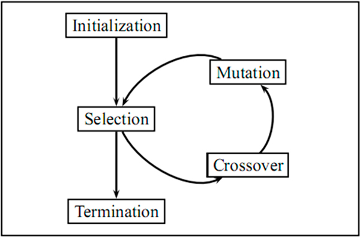
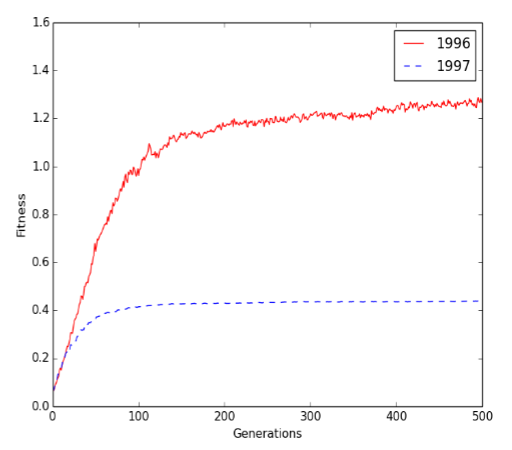

## Traveling Salesperson Problem
* Deliver ECU T-shirts to 7 stores in Greenville.
* Brute force time complexity: N!, N is the number of vertices.
* Genetic Algorithm (GA)
* GA: Inspired by genetic evolution process:
  * Chromosome (population)
  * Crossover
  * Mutation
  * Survival of fittest
* Advantage: no need to know the best way to solve the problem, try different possible solutions until results converge
* Key evaluate solutions and generate different solutions

## High Level GA



* Materials Credit: <https://www.youtube.com/watch?v=3GAfjE_ChRI>
* [Figure](#figure1)
* Chromosomal Mutations [Figure](#figure2)



* Crossover example: Sex-determination system [Figure](#figure3)
  * XY and XX
  * Female XX; Male XY



* Natural Selection
* Chromosome includes information and rules can filter unfitted chromosomes. 
* [Figure](#figure4)



## Traveling Salesperson Problem
* Let’s come back to the TSP problem.
* If we can encode a TSP solution (maybe not a good one) into a chromosome and define rules to filter unfitted chromosomes, we may generate better results.

## GA Workflow

* Steps:

## Traveling Salesperson Problem



* How to define a path using Chromosome idea?
* Similarly, each TSP solution should contain all the vertices exact once (path not a circuit). [Figure](#figure5)

## Crossover: Method 1



* How to generate new chromosomes: Crossover and Mutation.
* Crossover 1: Select last N numbers from P2, and take them out from P1
* Each solution needs to include all the vertices based on TSP. [Figure](#figure6)

## Crossover: Method 2



* Crossover 2: Select last N numbers from P1, and take them out from P2 [Figure](#figure7)

## Mutation: Method 1



* Mutation 1: change order [Figure](#figure8)

## Mutation: Method 2



* Mutation 2: change position [Figure](#figure9)

## GA Workflow
* Board

## When to stop?
* When your results converge.

## GA limitations
* It is hard to implement a real time GA application.
  * How to solve this issue?
* GA may not find out the global optimal solution.
  * How to solve this issue?
  
## 15 minutes: SSOI

## Boosting: Sample Code
* GradientBoostingClassifier
* Using learning rate to control overfitting issue 

||[Index](../../)||| [Prev](../)|||

