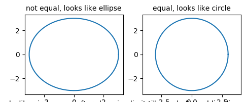

* Similarly, if your scree plot is like this, you can have 2D graph to represent 4D data: [Figure](#figure1)



* What about this one [Figure](#figure3)? Can you use 2D graph to represent 4D? Why?



## SVM—More than two classes
* I forgot to mention this in our last class…
* One-Versus-One Classification:
* Suppose that we would like to perform classification using SVMs, and there are K > 2 classes. A one-versus-one or all-pairs approach constructs K(K − 1)/2 SVMs, each of which compares a pair of classes.
* One-Versus-All Classification

## SVM—facial recognition

* Only two students have watched the video… So let’s briefly walk through the code.
  * Whitening: preprocessing step. The goal of whitening is to make the input less redundant; more formally. This can help to make (i) the features less correlated with each other, and (ii) the features all have close variance.

* Also, something about HW4. If you find the three methods have similar results…

## PCA Sample Code

* axis('equal') changes limits of x or y axis so that equal increments of x and y have the same length; a circle is circular.
* axis('scaled') achieves the same result by changing the dimensions of the plot box instead of the axis data limits.

## PCA Handwriting Digit
* Two possible ways to do dimensionality reduction:
  * Method 1: Choose from 64 features, only select 8 important cells (features). Similar to: you are required to select n letters (a, b, c…) from alphabet table to write an article
  * Method 2: PCA, create 8 principle components. Each component contains some information of 64 features. Similar to: you are required to select n words from frequently used words table to write an article.
* Np.cumsum: return the cumulative sum of the elements along a given axis.
* Filtering noise:
  * The principle component with large amount of information (higher variation) will not be affected by noise.
  * Np.random.normal: generate noise data based on normal distribution.
  
## Group Activity 8: PCA



* PCA can improve machine learning model performance. Even without reduce dimensionality.
* Why the performance is improved? [Figure](#figure3)
  * Still the 3D data. 

## Homework 5: Group Homework
* Work on the jupyter notebook at: <https://github.com/ruiwu1990/CSCI_4120/blob/master/SVM/HW5.ipynb>
* You are required to classify digits with SVM models.
* Compare performance of linear, radial, and polynomial kernels (classification score).
  * Tune kernel parameters using RandomizedSearchCV method.
* Use PCA to reduce data dimensionality (80% information remain).
* README.MD file
  * Team member names and email addresses
  * Parameters selected for linear, radial, polynomial kernels.
  * Results comparison between linear, radial, polynomial kernels
* Due...

## Plan
* 6 classes:
  * 2 classes: Tree-based methods
  * 2 classes: genetic algorithm
  * 1 class: group activity, process a data file together
  * 1 class: review
  
||[Index](../../../)||| [Prev](../)|||

