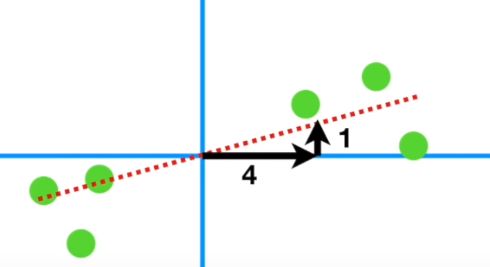
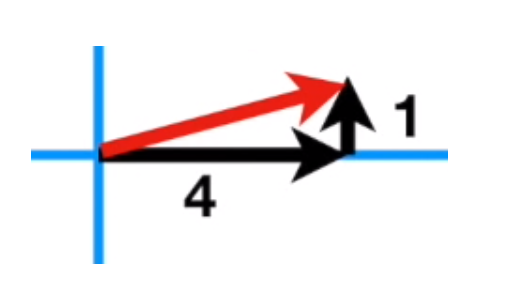
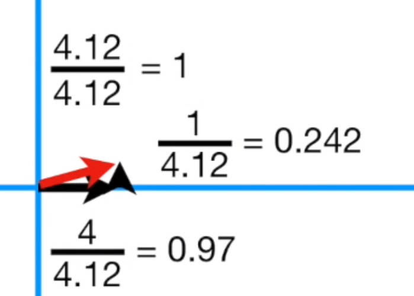
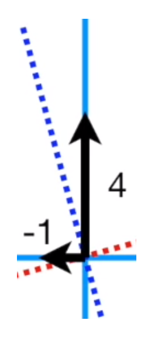
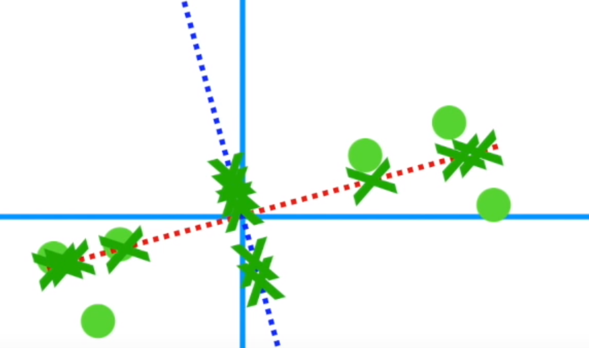
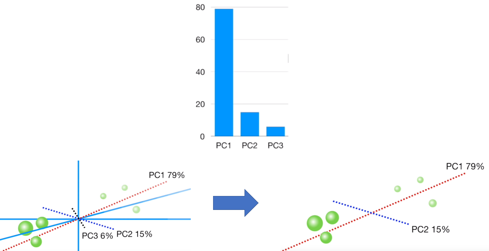
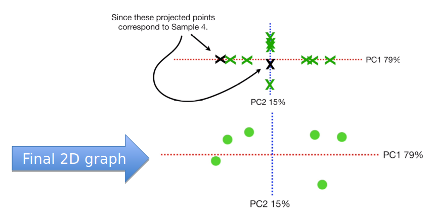

## Principal Component Analysis

* We have learned some machine learning models. But those may not be enough for a practical problem.
* If you want to predict 2019 US GDP and you have tons of features available online, such as unemployment rate, inflation rate and so on.
* Should you use as many features as possible?
* How to select or generate the useful features?
* Check this three questions
  * Do you want to reduce the number of variables, but aren’t able to identify variables to completely remove from consideration?
  * Do you want to ensure your variables are independent of one another?
  * Are you comfortable making your independent variables less interpretable?
* If your answers are “yes” for all these three question, use PCA to reduce the data dimensionality.

* Based on: <https://towardsdatascience.com/a-one-stop-shop-for-principal-component-analysis-5582fb7e0a9c>



* Let’s learn how to PCA to do dimensionality reduction.
* What is dimensionality reduction? 3D world -> 2D movie [Figure](#figure1)
* Based on: <https://www.youtube.com/watch?v=FgakZw6K1QQ>



* Shifting: subtract all points with the new origin point. 
* Shifting will not change the relation between your data points. E.g., highest data point is still the highest. [Figure](#figure2)

* Two methods to fit the red dot line:
  * Minimize RSS (i.e. black dot arrow line), similar to linear regression
  * Maximize the distances between green cross and origin
* The final line is called Principle Component 1 (PC1) [Figure](#figure3)



* If our fitted line slop is 0.25, it means every 4-unit growth along x-axis will have 1 unity increasement along y-axis, i.e. gene one plays a more important role to describe data.

* If we want to use a vector to represent the slop 0.25, it will be the red one (4.12) in the following image:

* If we want to scale the red vector into length one (unit factor), it will be like the following:

* The slop is not changed after this step. The unit factor is called “singular vector” or “Eigenvector” for PC1. Contains 0.242 gene 2 and 0.97 gene 1.



* PC2 is much easier to get. Just a perpendicular line through origin [Figure](#figure4)

* Similarly, we can calculate the PC2 eigenvector, which contains -0.242 gene 1 and 0.97 gene 2:



* After we have PC1 and PC2, we can use PC1 and PC2 to have a new coordinate system to redefine our data. We need to rotate PC1 (red line) and PC2 (blue line). [Figure](#figure5)

* Now we have our PCA graph done using Singular Value Decomposition (SVD)

* Eigenvalue (squared sum distances) calculations: PC1 eigenvalues sum of $$xi^2$$. PC2 eigenvalues sum of $$yi^2$$. [Figure](#figure6)



* Then we need to calculate variations for both PC1 and PC2

$$\frac{SS(distance for PC1)}{n-1} = Variation for PC1$$

$$\frac{SS(distance for PC2)}{n-1} = Variation for PC2$$

* Eigenvalue (squared sum distances) comparison: Scree plot left bar chart (PC1 variation vs PC2 variation) [Figure](#figure7)



* OK, let’s come back to dimensionality reduction. If we have three dimensions and want to show data in 2D: [Figure](#figure8)



* First, draw the Scree plot.
Based on the plot, PC1 and PC2 are important. So we will ignore PC3.

* Last step, we place our sample data points into PC1 and PC2 coordinate system based on their projection points (green cross) on PC1 axis and PC2 axis.

|||[Index](../../)||| [Prev](../)|||[Next](PCA-2)|||

