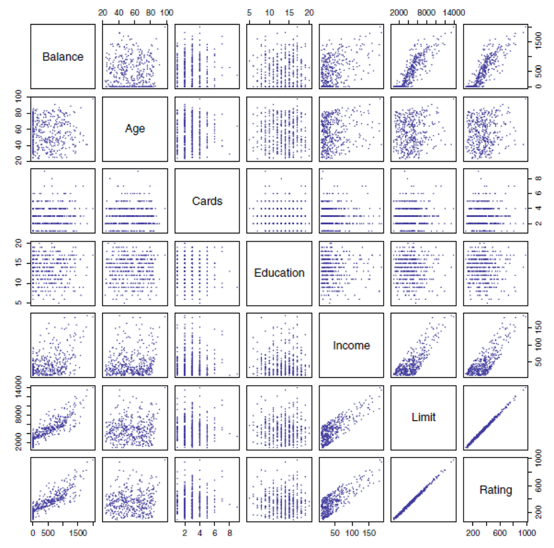


Machine learning (ML) is the scientific study of algorithms and statistical models that computer systems use to perform a specific task without using explicit instructions, relying on patterns and inference instead (wiki).

- Features that not noticeable by a human. With few instructions.
- Remember: machines do not know physical meaning, only numbers

# Data Type

### Continuous Data

- Data can be any value within a range
- E.g., a student’s height, a dog’s weight, an item’s price
- “Numbers” do not mean continuous data for sure.



### Discrete Data

- Data can be only from certain values.
- E.g. the results of rolling a dice (number) and number of students in a class (cannot be half a student)

### Qualitative Data

- Descriptive information (words)

### Quantitative Data

- Numerical information (numbers)

# **Examples**

### Predict Your Bank Account Balance

### Email Spam Detection

### Predict Wage

|||[Index](../../../)||| [Prev](../combinations)||| [Next](../supervised-learning)

