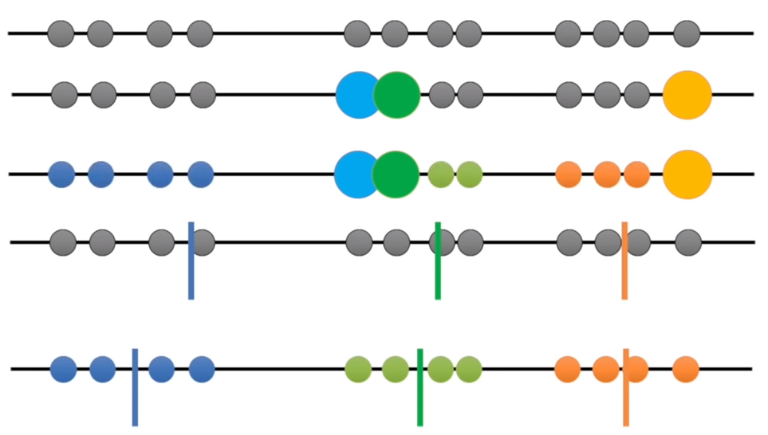

- K-means clustering aims to partition n observations into k clusters in which each observation belongs to the cluster with the nearest mean.
- If you want to separate different car models into 4 categories based on horsepower, engine displacement, and MPG, you can use K-means.
- KNN is unsupervised learning and a clustering algorithm (involves the grouping of data points). 
- K represents # of centroids.

Figure Credit: https://blogs.oracle.com/bigdata/k-means-clustering-machine-learning

#### An Example

Example is based on: https://www.youtube.com/watch?v=4b5d3muPQmA

### K-Means: Advantages vs Disadvantages
#### Advantages:
- Easy to implement.
- K-means model dynamically updated: centroid can be updated if new dataset is added.

#### Disadvantages:
- Hard to guess K
- Initial centroid can impact results
- K-means is time consuming. Need to calculate distances between new centroid in every loop.
- K-means method may not find out the global best solution. It sometimes returns local optimum.
- K-means is limited to linear cluster boundaries.

||[Index](../../)||| [Prev](../)|||[Next](k-means-algo)|||
