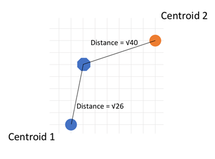
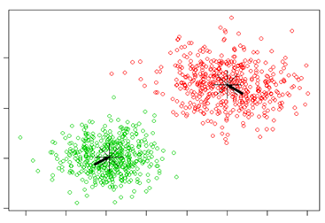

### Here are K-means algorithm steps:

Step 1: Choose a K: it represents the number of centroids. Hard to decide… especially for high dimensional data. You will learn it in your homework 2.

Step 2: Randomly selected centroids positions

Step 3: Calculate distances between each data point with K centroids and decide cluster response (closer)

Step 4: Calculate the mean value of each cluster, use the mean value as the new centroid

Step 5: repeat step 3 and 4 until you have repeated N (maybe 100) times or centroids do not change anymore.

||[Index](../../../)||| [Prev](../k_means)|||[Next](../elbow)|||
