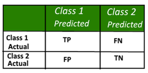

- Used for classification models.

- A confusion matrix is a summary of prediction results on a classification problem.

- The number of correct and incorrect predictions are summarized with count values and broken down by each class. This is the key to the confusion matrix.

- The confusion matrix shows the ways in which your classification model is confused when it makes predictions.

- It gives us insight not only into the errors being made by a classifier but more importantly the types (to be learned) of errors that are being made.

Example:

An example of 2-class classification problem

Class 1 : Positive

Class 2 : Negative

||[Index](../../../)||| [Prev](../knn-steps)|||[Next](../classification)|||
