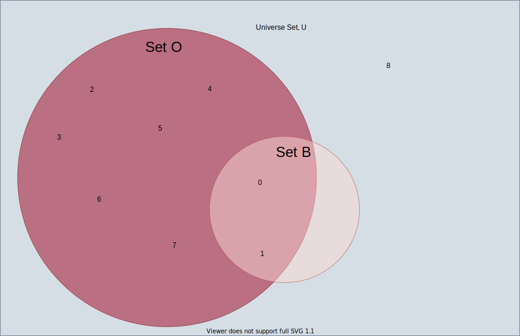
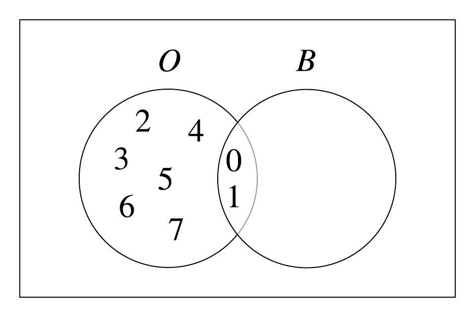

The difference of two sets $$A$$ and $$B$$, denoted as $$A \backslash B$$, is the set of elements in $$A$$ but not in $$B$$.  The symbol, $$A - B$$ is also used to denote set difference.

**Example 1:**
Let $$O = \{0, 1, 2, 3, 4, 5, 6, 7\}$$ be the set of octal digits and $$B = \{0, 1 \}$$ be the set of binary digits.
Then:

$$O \backslash B = O - B = \{2, 3, 4 , 5, 6, 7\}.$$

There are the elements in the set $$O$$ but not in the set $$B$$.  The Venn diagram shown below illustrates the set difference:


<!---  --->
<!---   --->

To compute $$O$$ \ $$B$$, find elements that are common to $$O$$ and $$B$$, and remove them from $$O$$.  More formally,
 
$$A \backslash B = \{x \vert x \in A$$ and $$ x \notin B \}$$

|||[Index](../../../../)||| [Prev](../set-union)|||[Next](../set-intersection)|||