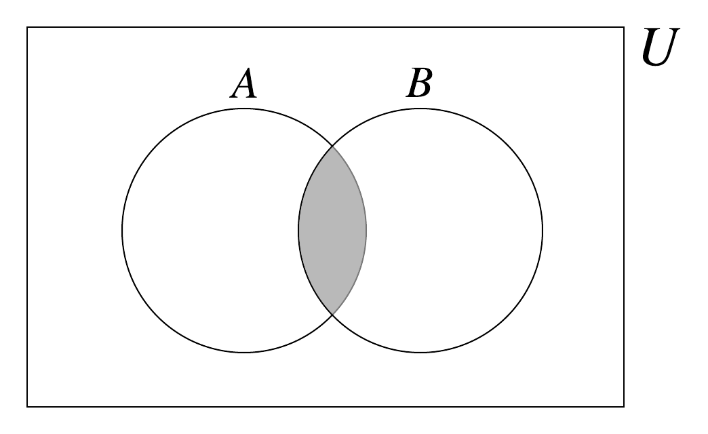
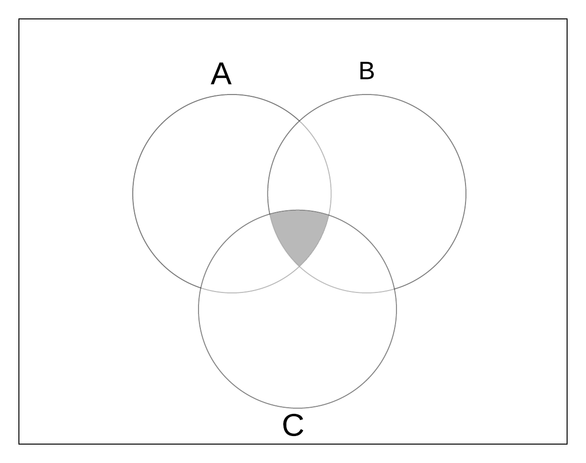

For two sets $$A$$ and $$B,$$ we define the set intersection of $$A$$ and $$B$$ to be a new set denoted $$A \cap B$$ where the elements of $$A \cap B$$ are all the elements $$x$$ where $$x$$ is in $$A \text{ AND } x$$ is in $$B.$$  In other words, the intersection of the two sets $$A$$ and $$B$$ is a set which contains elements that are in both the sets.

Using symbolic notation, the intersection of two sets $$A$$ and $$B$$ is written:

$$A\cap B = \{x \text{ such that} x \in A \text{ and } x \in B \}.$$
    
An equivalent biconditional statement can be made to define the intersection of two sets which is useful representation especially in proofs. 

$$x \in A \cap B \Leftrightarrow x \in A \text{ and } x \in B$$
    
The translation of this statement is: "x is in the intersection of the sets A and B if and only if x is in A and x is in B." It is helpful to break the statement into two implications.

"If x is in the intersection of A and B then x is in A and x is in B." AND "If x is in A and x is in B then x is in the intersection of A and B."

**Example 1:**

Let $$A = {2, 4, 6, 8, 10},$$ &nbsp; $$B = {1, 2, 3}$$, &nbsp; $$C = {5, 7}$$ &nbsp; and $$D = \emptyset.$$ Then some of the possible intersections among these sets are: 

$$A \cap A = \{2, 4, 6, 8, 10\}$$ &nbsp;  &nbsp;  &nbsp; &nbsp; &nbsp; $$A \cap B = \{2 \}$$  &nbsp; &nbsp; &nbsp; $$A \cap C = \emptyset$$ &nbsp; &nbsp; &nbsp; $$A \cap D = \emptyset$$  

$$B \cap A = \{2 \}$$ &nbsp;  &nbsp;  &nbsp; &nbsp; $$B \cap B = \{1, 2, 3 \}$$  &nbsp; &nbsp; &nbsp; $$B \cap C = \emptyset$$ &nbsp; &nbsp; &nbsp; $$B \cap D = \emptyset$$  
 

The definition of set intersection allows for the result of a set intersection to be the empty set.  This occurs when the two sets do not share any elements in common. Two sets are said to be mutually disjoint if the intersection of the sets is the Empty set.

Given that $$A$$ and $$B$$ are sets. The sets $$A$$ and $$B$$ are disjoint if and only if $$A \cap B = \emptyset.$$ 

**Example 2:**

Subtle nuances of representation and context should always be considered.  For example, let $$B = \{0,1\}$$ be the set of binary digits using a single bit, and $$D = \{0,1\}$$ be the set of decimal digits (type integer) and $$S = \{0, 1\}$$ be the set of the two characters 0 and 1 as "strings."  Visually, these three sets look the same.  An important question to ask is "Are the elements in B the same elements in D the same as those in S in the current context?"  If an element's type dictates a different treatement of the element, then elements must be compared based on defining properties in context.  

A visual representation for a set intersection can be helpful when studying the derived set. A Venn diagram is one way to depict the intersection of sets. In the following image, the sets A and B are drawn as circles and the intersection of A and B, $$A \cap B,$$ is indicated by the shaded area.

<!---  --->


<!---  --->

**Example 3:**
Let $$B={0,1}, O={1,2,3,...7} \text{ and } D={0,1,2...9}$$ then  
$$B\cap O\cap D = ((B\cap O) \cap D) = \{0,1\}$$  The intersection of sets in the expression is independent of the order that we apply the intersection. 

The Venn Diagram for the Three Sets $$A, B$$ and $$C$$ is showm below. The Shaded area represents the intersection.

<!---  --->


<!---  --->
 
There are some key properties about set intersection that should be noted: 
For sets $$A,$$ $$B$$ and $$C,$$ and the complement set of $$A$$, $$A^{c},$$ 

set intersection is:  
&nbsp;  &nbsp;  &nbsp;1.  **commutative**: $$A \cap B$$ is the same set as $$A \cap B$$  
&nbsp;  &nbsp;  &nbsp;2. **associative**: $$(A \cap B) \cap C$$ is the same set as $$A \cap (B \cap C)$$  

set intersection has an identity:  
&nbsp;  &nbsp;  &nbsp;3. $$A \cap \emptyset = A$$ 

set intersection has negatives:  
&nbsp;  &nbsp;  &nbsp;4. $$A \cap A^{c} = \emptyset$$

If there is a Univesal set, U, then  
&nbsp;  &nbsp;  &nbsp;4. $$A \cap U = U.$$  

The intersection operation of sets can be extented to an infinite number of sets as illustrated in the following example:

**Example 4:**
Let $$S = $$ be the countably infinte set of sets $$S_n,$$ where $$n \in Z^+.$$  That is $$S$$ is a set of elements and each element is a set that we index with a positive integer.  The elements $$S_1$$,$$ S_2$$,$$ S_3$$,... are the also sets.

The intersection of all elements in $$S$$ is expressed as follows: 

$$\bigcup_{n}S_{n}$$ where n = 1,2,3,.... The intersection is a set where an element is in the intersection if and only if it is a member of every set.

That is x $$ \in \bigcap_{n} S_{n}$$, if and only if x $$ \in S_{n}$$, for all n.

||| [Index](../../../../)|||  [Prev](../set-difference)|||  [Next](../cartesian-product)
